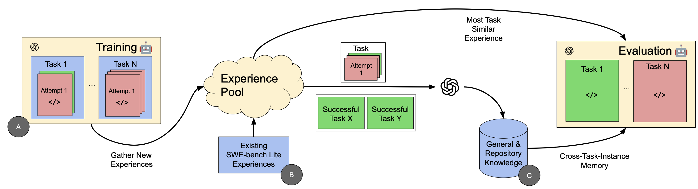

# CTIM-Rover

Figure inspired by [ExpeL](https://arxiv.org/abs/2308.10144).

In this repository we release the code and data accompanying our paper "From Knowledge to Noise: CTIM-Rover and the Pitfalls of Episodic Memory in Software Engineering Agents".

With CTIM-Rover, an forked agent for Software Engineering built on top of [AutoCodeRover](https://arxiv.org/abs/2404.05427), we investigate if the experiental learning approach for episodic memory introduced in [ExpeL](https://arxiv.org/abs/2308.10144) generalizes to the more challenging software engineering domain. We find that this implementation, even with modifications, does not currently generalize to software engineering and actually degrades performance compared to the baseline AutoCodeRover. As likely culprit we identify noisy CTIM items leading to suboptimal initial repository exploration decisions of the agent. For details on our findings, we refer the to our paper.

## Contents of This Repository
In the `ctim-rover-results` directory we release the cross-task-instance memory (CTIM) used for our evaluations as `ruleset.json` and `repo_ruleset.json`. These were created using o1, we also release all other CTIMs we experimented with during our project and logs and cost metadata on the CTIM construction process in this folder.

The `runs_stored.zip` archive contains all trajectories of all evaluation runs referred to in our project and preliminary evaluations with CTIMs that we constructed based on SWE-bench Lite trajectories for preliminary investigations. In `run_output_train_full.zip` we release the full results of our training run with self-reflection and all SWE-bench Verified trajectories we collected this way.

In the `app` the modified version of AutoCodeRover, CTIM-Rover, with options for using 
- general level CTIM
- repository level CTIM
- exemplar-based in-context learning

In the `ctim-rover-scripts` folder we release our knowledge distillation scripts and Reflexion-based training/data collection pipeline as well as notebooks for data exploration, evaluation and dataset splitting.

For the dataset creation process we use the annotations released with [SWE-bench Verified](https://openai.com/index/introducing-swe-bench-verified/) and the leaderboard standings on this benchmark. We do not bundle the leaderboard data we use with this repository due to GitHub file size limitations, but they can be downloaded from the [SWE-bench website](https://www.swebench.com). The AutoCodeRover SWE-bench Lite trajectories we mention in the paper are located in and taken from `acr-results/acr-val-only` folder.